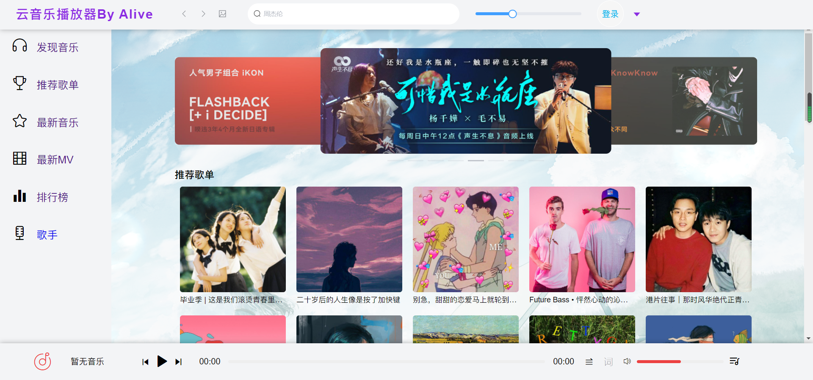
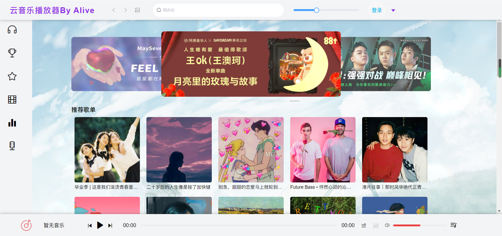
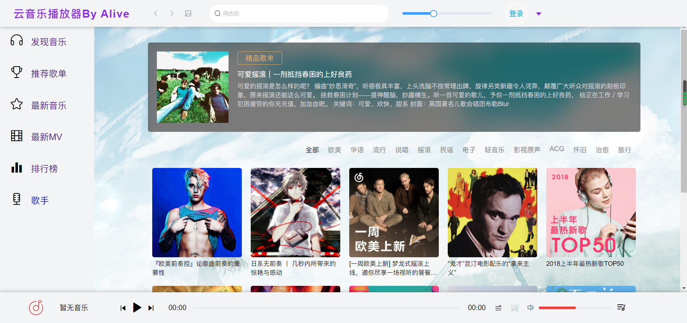
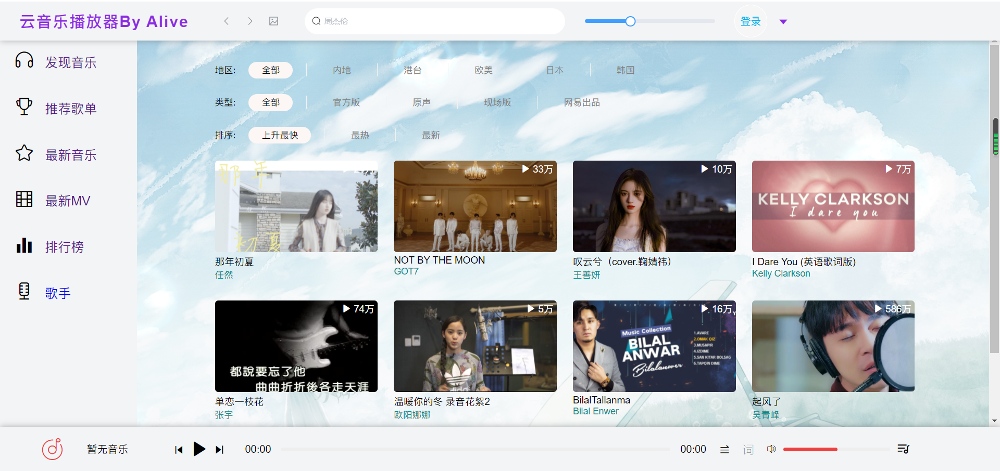
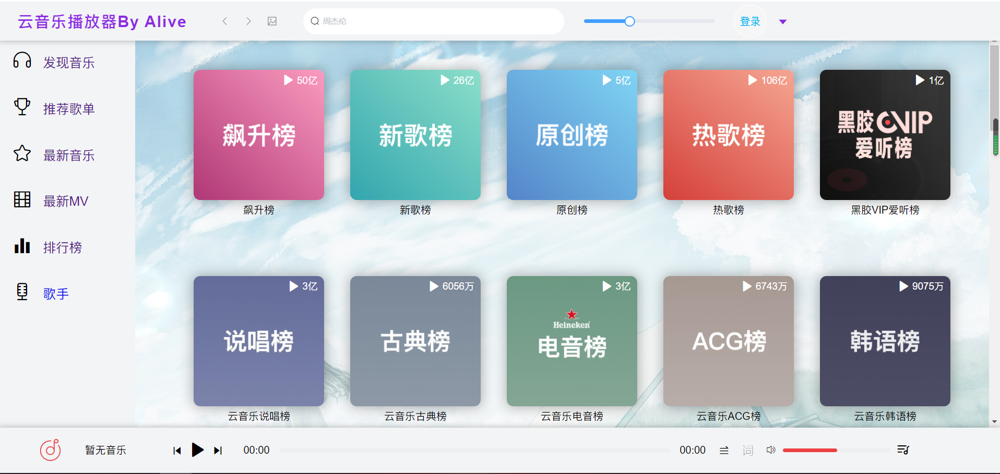
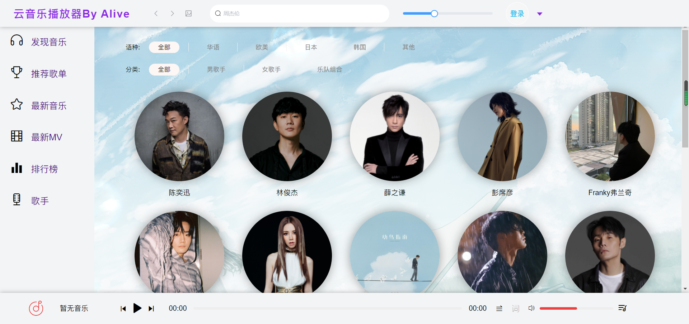

## 云音乐播放器By Alive
作者：[AliveSeven](https://www.bookbook.cc/) 

预览地址：[https://aliveseven.github.io/MusicCloud/dist/index.html#/discovery](https://aliveseven.github.io/MusicCloud/dist/index.html#/discovery) 

前端地址(源码)：[CloudMusic](https://github.com/AliveSeven/MusicCloud) 

后端地址(源码)：[NeteaseCloudMusicApi](https://github.com/Binaryify/NeteaseCloudMusicApi) 

接口文档：[API接口文档](https://neteasecloudmusicapi.vercel.app/#/?id=neteasecloudmusicapi) 

## 说明
如果你觉得本项目对你有帮助的话，请点个 Star 支持一下吧，谢谢你哦

在学习该项目的过程中，如果你遇到任何问题都可以联系我。

## 技术栈
- Vue
- VueRouter
- Vuex
- Axios
- Element-UI
- HTML5、CSS3、JavaScript、ES6、Less
- lazy-load
- Github Page、Vercel

## 一、如何运行该项目？
首先 clone 该项目
```
git clone https://github.com/AliveSeven/MusicCloud.git
```
进入该项目后，安装依赖
```
npm install
```
运行该项目
```
npm run serve
```

> 注：如果数据加载不出来，可能是接口更换或者失效了，接口可以通过Vercel部署。
>
> ​	   本项目仅供学习交流使用，未经作者同意，禁止转载或作其他用途
## 二、预览截图

### 2.1 首页(展开)



### 2.2 首页(折叠)


### 2.3 歌单页




### 2.4 MV列表页


### 2.5 排行榜


### 2.6 歌手

